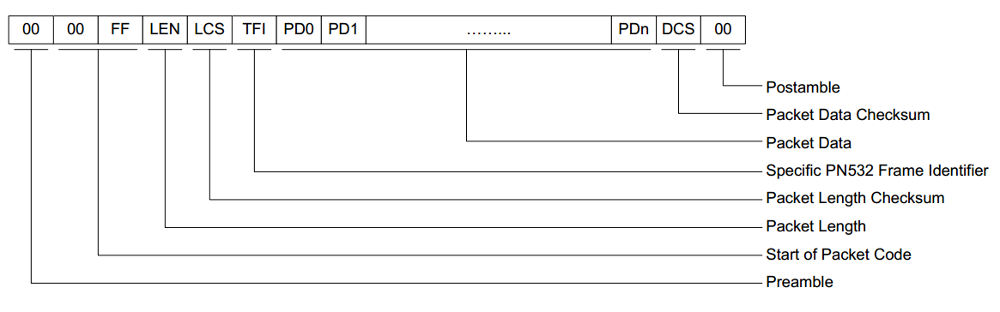
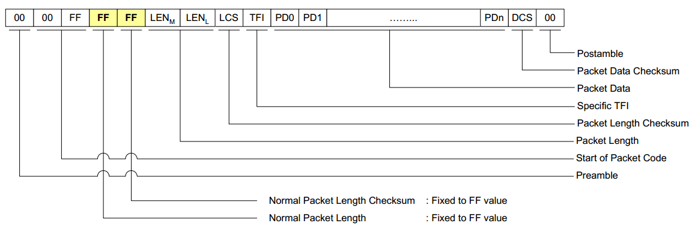
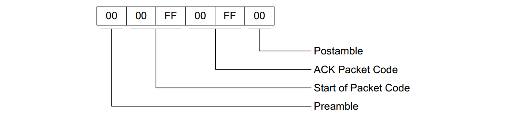
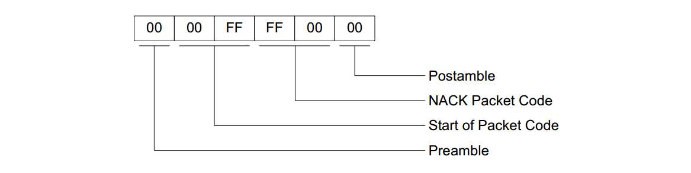
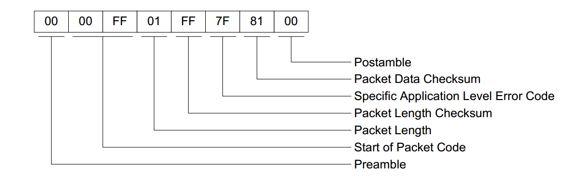

详细信息见[PN532用户手册](https://sirmegamu.github.io/others/pn532um.pdf)

### 信息帧

#### 普通帧的结构

> PREAMBLE，帧头，一字节
>
> `00`

> START CODE，开始码，两字节
>
> `00 FF`

> LEN，数据长度，一字节

> LCS，长度检验，一字节
>
> LEN的补码的低位

> TFI，数据方向，一字节
>
> `D4`表示数据流向PN532
>
> `D5`表示数据流向控制器

> DATA，数据，LEN-1字节
>
> 从PD0到PDn，PD0为控制字符，其余为普通数据

> DCS，数据检验，一字节
>
> TFI+PD0+···+PDn+DCS的补码

> POSTAMBLE，帧尾，一字节
>
> `00`

#### 扩展帧

> LEN 和LCS都填充为`FF`

> LEN，扩展长度，两字节
>
> 实际长度为LEN_L×256+LEN_M

> LCS，长度检验，一字节
>
> LEN_M+LEN_L的补码的低位

PN532会自动选择最适合的帧，在数据量小的时候选择普通帧，在数据大时选择扩展帧

#### ACK帧

用于同步信息或终止机制

可以从控制器发向PN532，也可以从PN532发向控制器，确认前一帧已经接收成功

#### NACK帧

用于数据包同步

只能由控制器发向PN532，指示没有成功接收到上一帧，请求PN532重新发送上一响应帧

#### Error帧

通知控制器PN532检测到出现应用层错误并提供错误码

### 命令

#### 唤醒

> 发送 `55 55 00 00 00 00 00 00 00 00 00 00 00 00 00 00 FF 03 FD D4 14 01 17 00`
>
> 返回 `ACK 00 00 FF 02 FE D5 15 16 00`

#### 获取卡UID（4字节）

发送`00 00 FF 04 FC D4 4A nn 00 DCS 00`

> `4A`：命令
>
> `nn`：卡的数量，最多为`02`
>
> `00`：波特率

返回`ACK 00 00 FF 0C F4 D5 4B 01 01 00 04 08 nn UID DCS 00`

> `4B`：响应命令
>
> `01`：目标卡
>
> `01`：目标卡数量
>
> `00 04`：鬼知道干什么的
>
> `08`：卡容量
>
> `nn`：UID字节数
>
> `UID`：UID的值

#### 密钥验证

发送`00 00 FF 0F F1 D4 40 nn 60 aa PASSWORD UID DCS 00`

> `40`：命令
>
> `nn`：卡号
>
> `60`：密钥验证命令
>
> `aa`：块号
>
> `PASSWORD`：密钥

返回`ACK 00 00 FF 03 FD D5 41 00 EA 00 `

> `41 00`：正确状态

#### 读

发送`00 00 FF 05 FB D4 40 01 30 aa DCS 00`

返回`ACK 00 00 FF LEN LCS D5 41 00 CONTENT DCS 00 `

#### 写

发送`00 00 FF 15 EB D4 40 01 A0 aa CONTENT DCS 00 `

返回`ACK 00 00 FF 03 FD D5 41 00 EA 00 `
